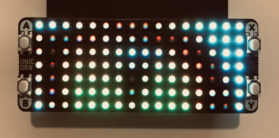
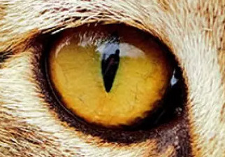

# pico-unicorn-experiment

Raspberry Pi Pico and Pimoroni Unicorn.

How the result could look like on Raspberry Pi Pico

converted from original

## pre-requisites

The HW: https://shop.pimoroni.com/products/pico-unicorn-pack

The SW:

* Pimoroni firmware flashed onto the Pico, get from: https://github.com/pimoroni/pimoroni-pico/releases
* Thonny: to manage and upload (optional, use any tools you ar used to)

